# Итоговое домашнее задание по ETL

## Реализация ETL-процесса в Yandex Cloud

Студент: Нелли Мамухова
Дисциплина: ETL-процессы
Модуль: 4

## Краткое описание

В этом проекте я собрала несколько ETL-сценариев в Yandex Cloud. Работа включает перенос данных из YDB в Object Storage, batch-обработку файла через Airflow и Data Processing, обработку сообщений из Kafka через PySpark и визуализацию результатов в DataLens.

Проект делался как итоговое задание по модулю. Основной акцент был на том, чтобы не просто запустить отдельные сервисы, а связать их в понятный процесс: подготовить данные, загрузить их в облако, обработать, сохранить результаты и показать их на дашборде.

## Использованные сервисы и инструменты

В работе использовались:

* Yandex Managed Service for YDB
* Yandex Data Transfer
* Yandex Object Storage
* Yandex Managed Service for Apache Airflow
* Yandex Data Processing
* Yandex Managed Service for Apache Kafka
* Yandex DataLens
* Python
* PySpark
* YQL
* GitHub

## Структура репозитория

```text
.
├── airflow/
│   └── applications_etl_dag.py
├── data_generators/
│   ├── generate_loan_applications.py
│   └── generate_transactions_v2.py
├── pyspark/
│   ├── kafka_consumer_flatten.py
│   ├── kafka_flat_analytics.py
│   ├── kafka_producer.py
│   └── process_applications_max.py
├── screenshots/
│   └── screenshots_with_results
├── yql/
│   └── create_transactions_v2.sql
├── .gitignore
└── README.md
```

Большие CSV-файлы не добавлены в репозиторий, потому что они занимают много места и могут быть заново получены через скрипты из папки `data_generators`.

---

# 1. Data Transfer: перенос данных из YDB в Object Storage

## Подготовка данных

Для первой части работы я подготовила таблицу `transactions_v2`. В ней находятся данные по звонкам и коммуникациям с клиентами. Данные были сгенерированы локально с помощью скрипта:

```text
data_generators/generate_transactions_v2.py
```

В итоговом файле было 400 000 строк. Размер CSV-файла получился больше 30 МБ, что соответствует условию задания.

Поля таблицы:

```text
call_id
call_time
client_id
region_code
campaign_type
call_status
client_response
duration_sec
follow_up_required
```

## Создание таблицы в YDB

В Yandex Cloud была создана база данных YDB:

```text
etl-ydb
```

Для создания таблицы использовался YQL-скрипт:

```text
yql/create_transactions_v2.sql
```

Схема таблицы:

```sql
CREATE TABLE transactions_v2 (
    call_id Utf8,
    call_time Utf8,
    client_id Utf8,
    region_code Utf8,
    campaign_type Utf8,
    call_status Utf8,
    client_response Utf8,
    duration_sec Uint32,
    follow_up_required Utf8,
    PRIMARY KEY (call_id)
);
```

После создания таблицы данные были импортированы в YDB из CSV-файла.

## Перенос данных через Data Transfer

Далее я настроила Yandex Data Transfer. В качестве источника использовалась таблица `transactions_v2` из YDB, а в качестве приёмника - бакет Object Storage.

Бакет:

```text
nelly-etl-final-2026
```

Результат выгрузки был сохранён в Object Storage в папку:

```text
datatransfer/transactions_v2/
```

Transfer был запущен в режиме копирования и завершился успешно. После завершения я проверила, что в Object Storage появились файлы с выгруженными данными.

## Результат по первой части

В результате первой части работы:

* создана база данных YDB;
* создана таблица `transactions_v2`;
* загружен CSV-файл размером больше 30 МБ;
* настроен transfer из YDB в Object Storage;
* результат выгрузки проверен в бакете;
* YQL-скрипт сохранён в репозитории.

Скриншоты:
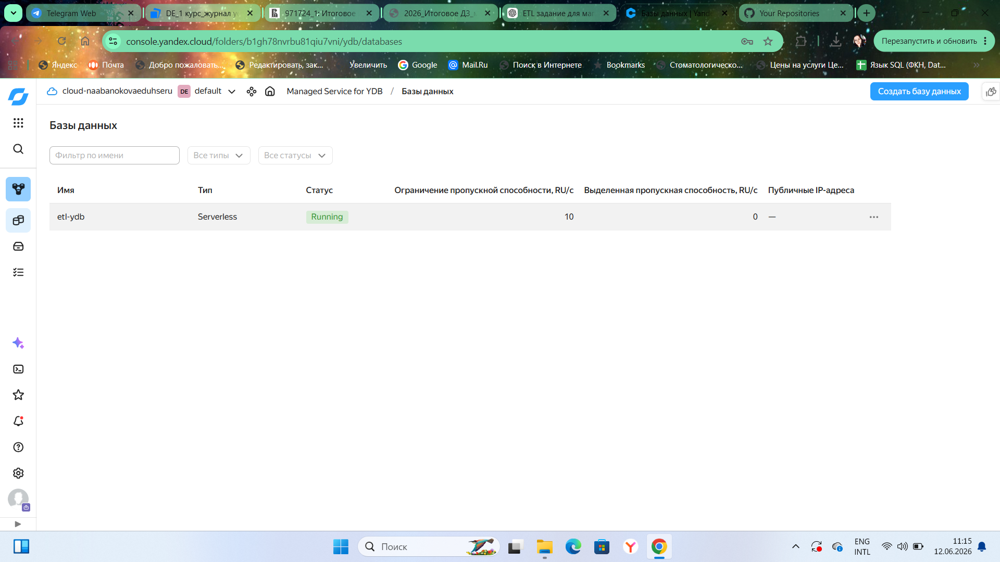

Проверка размера файла `transactions_v2.csv`:

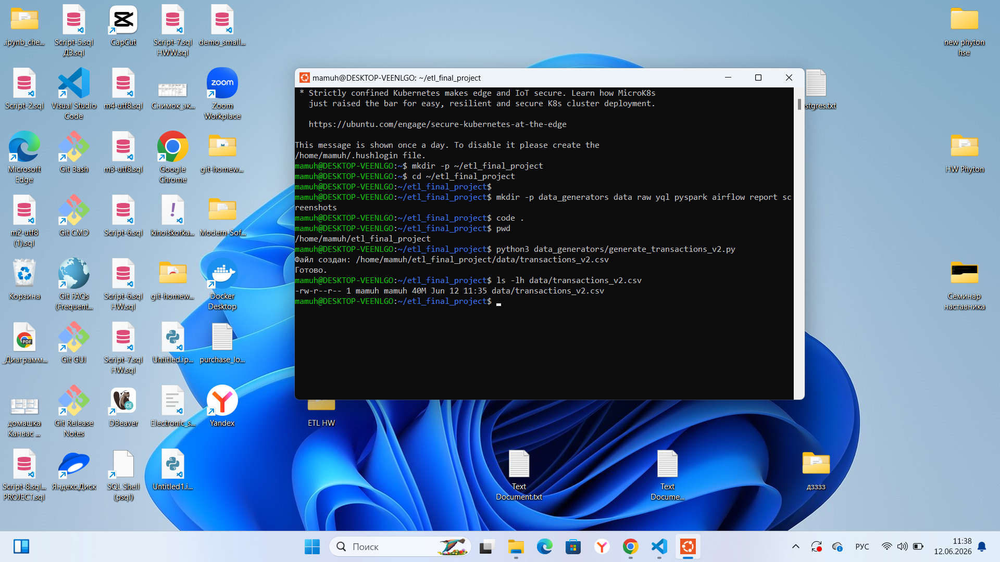

Проверка количества строк в таблице YDB:

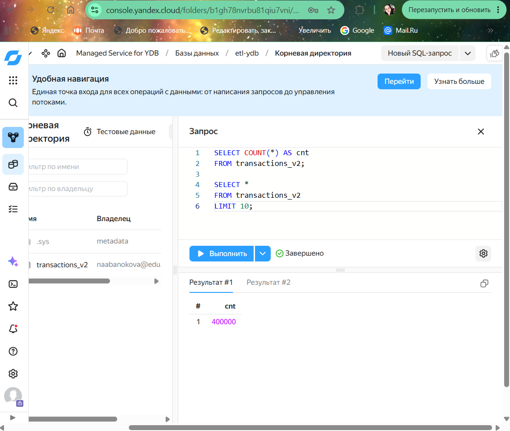

Просмотр данных в таблице YDB:

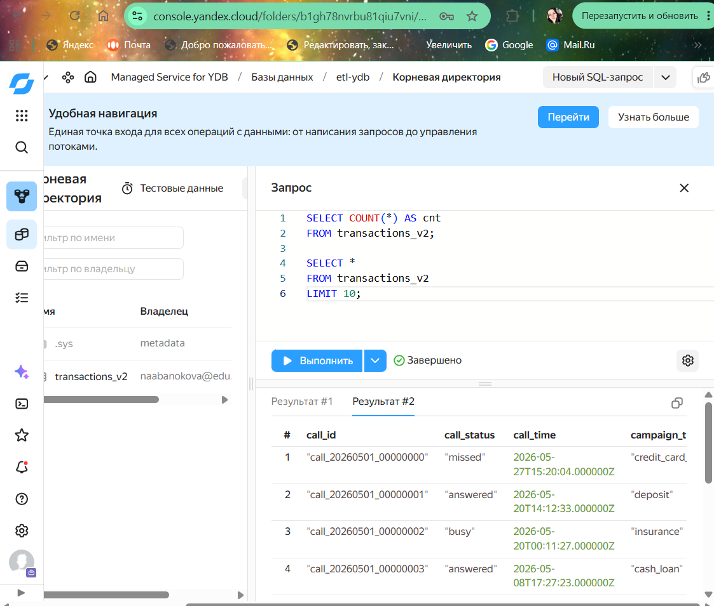

Успешно завершённый transfer из YDB в Object Storage:

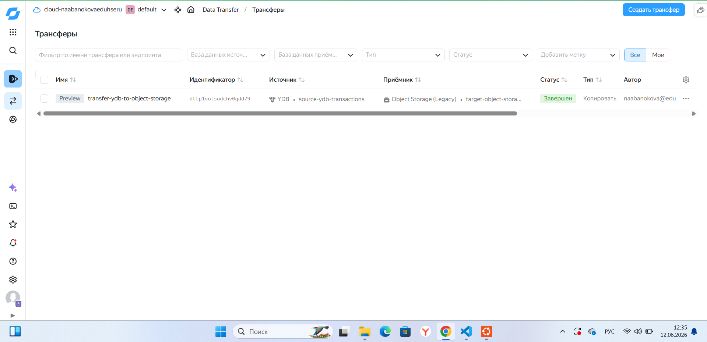

Результат выгрузки в Object Storage:

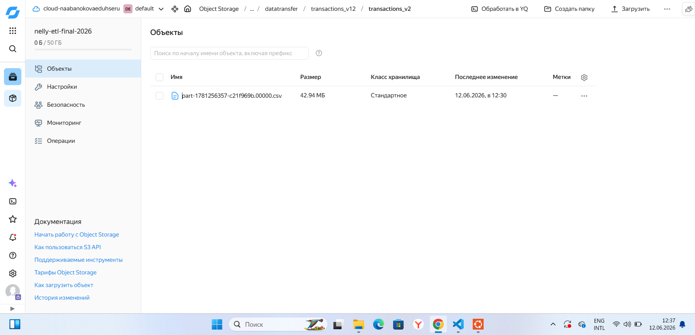


---

# 2. Airflow, Data Processing и PySpark

## Входные данные

Для второй части был подготовлен отдельный CSV-файл с данными по кредитным заявкам. Данные генерируются скриптом:

```text
data_generators/generate_loan_applications.py
```

Размер файла получился больше 50 МБ.

Основные поля:

```text
application_id
event_time
customer_id
region_code
product_type
requested_amount
term_months
credit_score
risk_level
decision_status
approved_amount
channel
employee_review_flag
processing_time_sec
```

Файл был загружен в Object Storage:

```text
s3a://nelly-etl-final-2026/raw/applications/loan_applications.csv
```

## PySpark-обработка

Для обработки файла был написан скрипт:

```text
pyspark/process_applications_max.py
```

Скрипт выполняет несколько шагов:

1. Читает исходный CSV-файл из Object Storage.
2. Приводит поля к нужным типам.
3. Создаёт очищенный слой данных.
4. Считает агрегированные витрины.
5. Формирует небольшой отчёт по качеству данных.

Результаты сохраняются в Object Storage:

```text
processed/applications/cleaned/
processed/applications/dm_region/
processed/applications/dm_product_risk/
processed/applications/dm_decision_channel/
processed/applications/quality_report/
```

Я специально сделала не одну итоговую таблицу, а несколько витрин, потому что так результат обработки удобнее использовать дальше для аналитики.

## Автоматизация через Airflow

Для автоматизации был создан DAG:

```text
airflow/applications_etl_dag.py
```

DAG запускает полный процесс:

1. Создаёт временный кластер Yandex Data Processing.
2. Запускает PySpark job.
3. Удаляет кластер после завершения работы.

Такой вариант удобнее, чем держать Data Processing-кластер постоянно включённым. Он создаётся только на время выполнения обработки.

Во время настройки возникла проблема с NAT для подсети. После добавления NAT gateway Data Processing-кластер смог корректно создаваться и выполнять задания.

## Результат по второй части

В результате второй части:

* подготовлен входной CSV-файл размером больше 50 МБ;
* файл загружен в Object Storage;
* написан PySpark-скрипт обработки;
* создан Airflow DAG;
* DAG успешно создал Data Processing-кластер;
* PySpark job успешно выполнился;
* результаты появились в Object Storage;
* временный кластер был удалён после обработки.

Скриншоты:
Проверка размера входного файла `loan_applications.csv`:

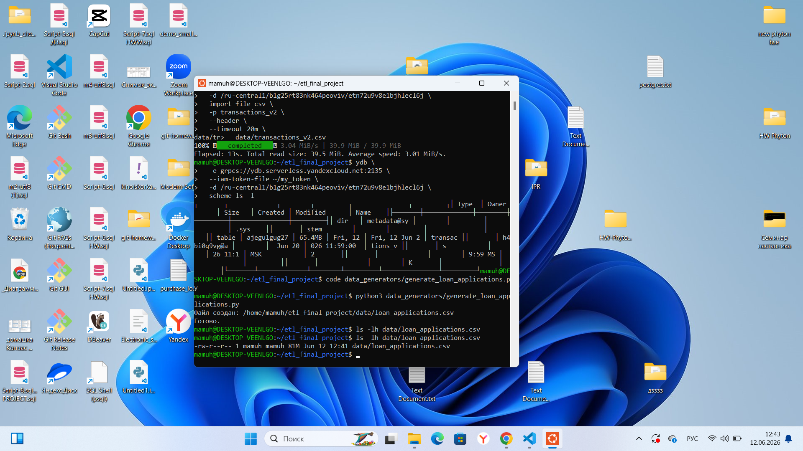

PySpark-скрипт загружен в Object Storage:


DAG-файл загружен в Object Storage:

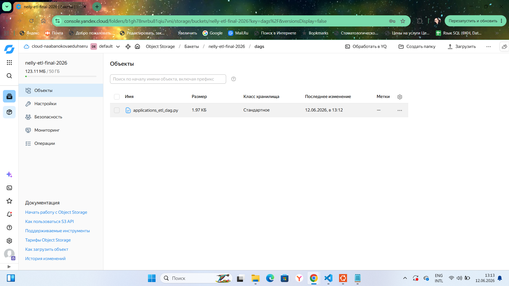

Успешное выполнение DAG в Airflow:

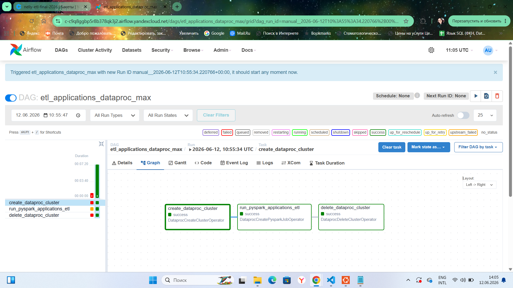

Результаты обработки появились в Object Storage:

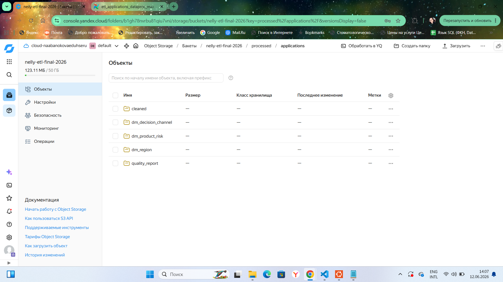

---

# 3. Kafka и PySpark

## Общая схема

В третьей части я работала с Kafka topic и PySpark-заданиями в Yandex Data Processing.

Общая схема получилась такая:

```text
PySpark producer -> Kafka topic -> PySpark consumer -> Object Storage -> analytics
```

Kafka topic:

```text
loan-applications-json
```

Пользователь Kafka:

```text
etl_user
```

Пароль пользователя в репозитории не хранится. В коде вместо него указан placeholder:

```text
<KAFKA_PASSWORD>
```

## Producer

Для отправки сообщений в Kafka был написан скрипт:

```text
pyspark/kafka_producer.py
```

Producer генерирует вложенные JSON-сообщения по кредитным заявкам и отправляет их в topic `loan-applications-json`.

Пример структуры JSON:

```json
{
  "application_id": "loan_00000001",
  "customer": {
    "customer_id": "cust_12345",
    "region": "DE-HE"
  },
  "loan": {
    "amount": 15000,
    "term_months": 36
  },
  "scoring": {
    "score": 710,
    "risk_level": "medium"
  },
  "documents": [
    {
      "type": "passport",
      "status": "verified"
    }
  ],
  "decision_status": "approved",
  "submitted_at": "2026-05-01T10:15:11Z"
}
```

Объём переданных сообщений был больше 20 МБ.

## Consumer и flatten JSON

Для чтения данных из Kafka использовался скрипт:

```text
pyspark/kafka_consumer_flatten.py
```

Consumer читает сообщения из topic, разбирает вложенный JSON и переводит данные в плоскую структуру.

Итоговый результат сохраняется в Object Storage:

```text
processed/kafka_flat/
```

Плоская таблица содержит поля:

```text
application_id
customer_id
region_code
amount
term_months
score
risk_level
document_type
document_status
decision_status
submitted_at
```

## Дополнительная Kafka-аналитика

Чтобы результат был не только техническим, но и аналитическим, я добавила ещё один PySpark-скрипт:

```text
pyspark/kafka_flat_analytics.py
```

Он читает данные из `processed/kafka_flat/` и строит агрегированную витрину:

```text
processed/kafka_analytics/
```

Также формируется quality report:

```text
processed/kafka_quality_report/
```

В аналитической витрине считаются:

* количество заявок;
* средняя сумма заявки;
* общая сумма заявок;
* средний скоринг;
* средний срок кредита.

## Технические сложности

При запуске Kafka job возникли две ошибки, которые были исправлены:

1. Spark сначала не находил источник `kafka`. Для этого был добавлен Maven package:

```text
org.apache.spark:spark-sql-kafka-0-10_2.12:3.3.2
```

2. Затем Kafka выдала ошибку авторизации на topic. После настройки прав пользователя `etl_user` producer и consumer успешно выполнились.

## Результат по третьей части

В результате третьей части:

* создан Kafka topic;
* настроен Kafka user;
* producer отправил JSON-сообщения в Kafka;
* consumer прочитал сообщения из Kafka;
* вложенный JSON преобразован в плоский вид;
* результат сохранён в Object Storage;
* дополнительно построена Kafka-аналитика и quality report.

Скриншоты:
Kafka-кластер создан и работает:


Producer job успешно отправил сообщения в Kafka:

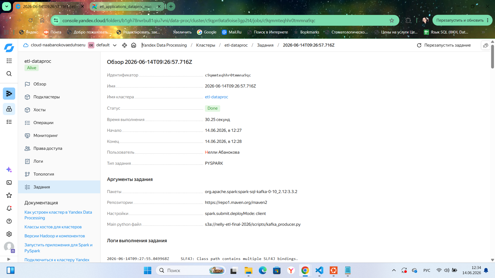

Consumer job успешно прочитал сообщения из Kafka:


Результат flatten JSON сохранён в Object Storage:


Дополнительная Kafka-аналитика успешно построена:

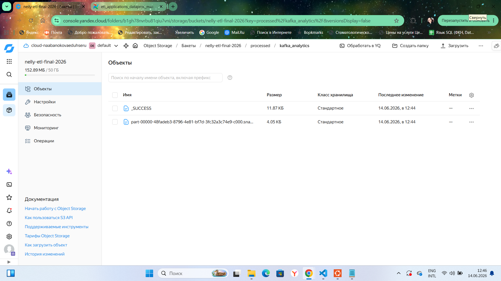

Файлы Kafka analytics и quality report в Object Storage:

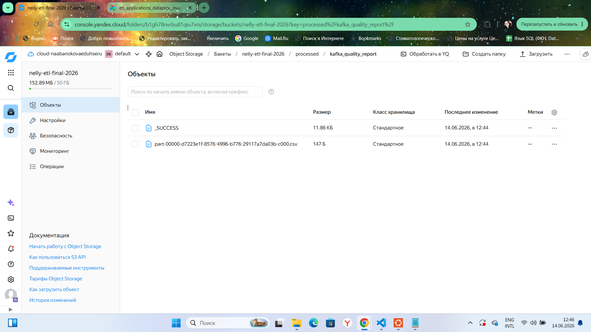


---

# 4. DataLens

## Подключение и датасет

Для визуализации я использовала Yandex DataLens. Было создано подключение к YDB:

```text
ydb_transactions_connection
```

На основе таблицы `transactions_v2` был создан датасет:

```text
ds_transactions_v2
```

## Чарты

В DataLens я создала 5 чартов:

1. Всего звонков
   Тип: индикатор
   Метрика: `COUNT(call_id)`

2. Количество звонков по регионам
   Тип: столбчатая диаграмма
   Измерение: `region_code`
   Метрика: `COUNT(call_id)`

3. Распределение статусов звонков
   Тип: круговая диаграмма
   Измерение: `call_status`
   Метрика: `COUNT(call_id)`

4. Реакция клиентов по типам кампаний
   Тип: столбчатая диаграмма
   Измерение: `campaign_type`
   Метрика: `COUNT(call_id)`
   Цвет: `client_response`

5. Средняя длительность звонков по регионам и кампаниям
   Тип: таблица
   Поля: `region_code`, `campaign_type`, `AVG(duration_sec)`, `COUNT(call_id)`

## Dashboard

После создания чартов я собрала итоговый dashboard:

```text
ETL Final Project Dashboard
```

На дашборде можно посмотреть:

* общее количество звонков;
* распределение звонков по регионам;
* статусы звонков;
* реакцию клиентов на разные типы кампаний;
* среднюю длительность звонков.

## Результат по четвёртой части

В результате:

* создано подключение DataLens к YDB;
* создан датасет `ds_transactions_v2`;
* создано 5 чартов;
* собран итоговый dashboard.

Скриншоты:
Датасет DataLens создан на основе таблицы `transactions_v2`:

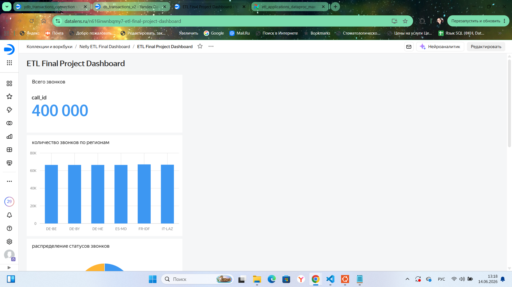

Список созданных чартов:

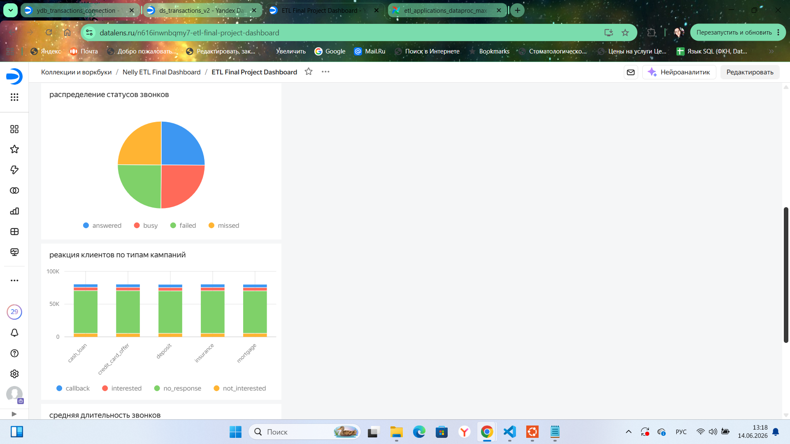

Итоговый dashboard:

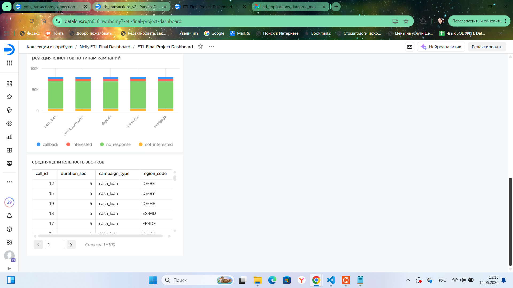


---

# Что сделано сверх базового варианта

В работе я добавила несколько элементов, которые не ограничиваются минимальным запуском сервисов:

* генерация собственных тестовых данных под каждую задачу;
* несколько аналитических витрин по кредитным заявкам;
* quality report для batch-обработки;
* отдельная аналитика по Kafka-данным;
* сохранение промежуточных и итоговых результатов в Object Storage;
* dashboard из нескольких визуализаций, а не один простой график;
* описание ошибок, которые возникали в процессе настройки, и способов их исправления.

---

# Безопасность

В репозиторий не добавлены:

* реальные пароли;
* IAM-токены;
* SSH private key;
* секретные ключи доступа;
* большие исходные CSV-файлы.

В Kafka-скриптах пароль заменён на:

```text
<KAFKA_PASSWORD>
```

Для исключения лишних файлов используется `.gitignore`.

---

# Итог

В рамках работы получился полный учебный ETL-проект в Yandex Cloud:

```text
YDB -> Data Transfer -> Object Storage

CSV -> Airflow -> Data Processing -> PySpark -> Object Storage

PySpark producer -> Kafka -> PySpark consumer -> Object Storage

YDB -> DataLens -> Dashboard
```

Мне удалось пройти все основные этапы работы с данными: генерацию, загрузку, перенос, batch-обработку, работу с Kafka, сохранение результатов и визуализацию. Отдельно были добавлены витрины и отчёты по качеству данных, чтобы результат был ближе к реальному ETL-пайплайну, а не только к демонстрационному запуску сервисов.